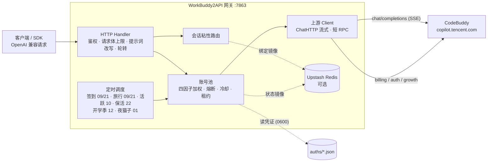

<h1 align="center">WorkBuddy2API</h1>

<p align="center">
  <b>把 CodeBuddy 账号变成 OpenAI 兼容 API 的多账号网关</b><br>
  OAuth 登录 · 账号池轮转 · 熔断与冷却 · 会话粘性 · 积分补充
</p>

> 本项目基于 [Sliverkiss/workbuddy2api](https://github.com/Sliverkiss/workbuddy2api) 修改,
> 原作者版权与 MIT 许可证完整保留于 [`LICENSE`](./LICENSE)。

<p align="center">
  
  
  
  
  
  
</p>

---

## 项目简介

WorkBuddy2API 是一个自托管的 **OpenAI 兼容反向代理网关**，将 ```CodeBuddy``` 账号包装为统一的 `/v1/chat/completions` 服务。

- 官方不提供 OpenAI 形态的开放 API，本项目通过 **OAuth 设备授权**（`login.sh`）获取账号凭证，在网关侧做 token 自动刷新、账号池调度与流量治理；
- 面向 **个人多账号** 场景：多账号共享、单号故障自动换号、冷却 / 熔断防止雪崩、会话粘性保证多轮上下文不跳号；
- 对客户端只暴露 OpenAI 兼容接口，现有 SDK / 前端 / 工具 **零改造接入**。

> ⚠️ 合规须知：本项目是**非官方**网关，使用 ```CodeBuddy``` 账号作为上游，**仅限本人授权账号、本机 / 私有环境测试**。详细边界见[安全与合规](#安全与合规)。

📖 更多说明见 [Wiki](https://github.com/aaliang319-source/workbuddy2apinew/wiki)。

## 核心能力

### 账号池治理

- **OAuth 设备授权登录** — `login.sh` 一条命令完成：取授权 URL → 浏览器登录 → token 轮询 → 凭证落盘 → 重启加载，全程无 PKCE（state 由服务端签发），重复执行即可连续添加多账号
- **四因子加权随机选号** — `credits 比例 ×10 + 闲置补偿 + 成功率 ×3 + 快过期积分占比 ×8` 四项加权（`pool.expiring_soon` 窗口内的积分优先消耗，默认 7 天），按权重降序取 **Top-5 候选短名单**，再在短名单内加权抽签（等权重候选先随机打乱防惊群、LRU 兜底覆盖全部候选），兼顾积分多、闲置久、成功率高、快过期积分先用掉的账号
- **防惊群** — 跳过 100ms 内刚被选中的账号，多账号同时待命时不打爆同一台
- **在途租约** — 单账号最大在途请求数（`pool.max_in_flight`）限制并发占用，占满的号不参与选号，避免单号过载
- **账本择优** — 每次成功请求按 `usage.credit` 折算每千 token 单价记入 `(账号, 模型)` 账本，免费 / 便宜的账号优先；观测按 EMA 平滑、6 小时未更新即失效，成本随上游活动实时变化

### 流量治理

- **分级熔断与冷却** — 429 软冷却（600s 起指数退避、封顶 `soft_rate_max`）、404 固定浅冷却、402 / 余额耗尽硬冷却至次日 04:00、连续失败熔断（`breaker_threshold` 触发后指数退避封顶 6h）
- **模型级限流独立冷却** — 6004（该模型使用量超限）只冷却触发调用的模型，切其他模型立即可用；`/status` 透出 `rate_limited_models` 台账
- **状态持久化** — 池状态（积分 / 冷却 / 熔断 / 计数）本地原子落盘 `state.json`，可选镜像至 Upstash Redis，重启后择优恢复

### 请求链路

- **流式 + 非流式** — 出站强制 `stream:true`；SSE 帧按 OpenAI 规范白名单重建；非流式由本地聚合为单响应
- **DeepSeek 思维链注入** — 出站请求体注入 `thinking.type=enabled` + 默认档位，`reasoning_content` 多轮回填，`reasoning_effort` 按模型档位自动降级
- **系统提示词体系** — 默认透传客户端原始 system（`passthrough` 模式，缺省），仅自定义配置 `custom` 时网关用自有提示词替换客户端 system/developer（从源头消除模板句误报）；`passthrough` 模式遇拦截自动降级中性提示词重试
- **会话头族注入** — 出站携带官方客户端会话头族（`X-Conversation-Request-ID` 聚合主键 · `X-Conversation-ID` 透传 · B3 链路），轮转 / 重试 / 路径回退复用同键，后台按对话轮聚合不再碎片化（issue #35）
- **指纹脱敏** — 出站请求体黑名单指纹字段清洗（可开关），与提示词体系两层叠加

### 定时积分任务

- **签到**（09 / 21 点）— 每日签到 + 余额查询，余额恢复自动解冻冷却账号
- **活跃上报**（10 点）— 对话事件连发上报，点亮连登天数、解锁领养前置，回读 streak 自检
- **猫猫旅行**（09 / 21 点）— 独立排程：领养 / 派出 / 领奖闭环推进
- **token 保活**（22 点）— 全账号刷新 token，session 失效连续 3 次才禁用
- **开学季任务**（12 点）— 任务点亮 + claim + 自动抽空抽奖余额，活动下线时自动跳过
- **夜猫子任务**（01 点）— 夜猫窗口（23:00–08:00 CST）内补一次 black_cat 任务

六类任务独立排程、独立开关（`schedule.*_enabled`），互不影响。

### 双域适配

- 同时适配**国内版（CN，`copilot.tencent.com` / `www.codebuddy.cn`）与国际版（Global，`www.workbuddy.ai`）**账号
- 共享同一账号池，由账号 `realm` 或请求模型名前缀（`cn:` / `global:`）决定路由；`global.enabled` 可一键锁死纯 CN 部署
- 国际版支持注册激活、地区完善、一次性 trial 加油包领取（`./trial.sh`）

### 辅助工具

- 积分日报：`./credit.sh`（美化 / `-json`，realm 感知双域）
- 手动签到：`./signin.sh`（批量、幂等不重复计）
- 领养联动 / 任务查询：`scripts/task_runner.py`（成长任务一体机，默认 dry-run）
- 个性化提示词：`prompt.file` 指向自定义提示词文件即整体替换内置默认

### 多 Key 管理

- **`internal/keys`** — 网关侧 API Key 管理：签发 / 吊销 / 备注，支持多 Key 并存
- Key 落盘 `data/keys.json`（`keys_file` 可配），旧模式单一静态 `api_key` 仍然兼容
- 请求明细按 Key 名归类（`key_name`），便于多租户 / 多客户端分摊排查

### 指标与统计

- **`internal/metrics`** — 按 `(账号, 模型)` 维度统计调用次数 / 成功率 / 平均时延 / 积分消耗
- 默认 `./data/metrics.json` 落盘（`server.metrics_file` 可配），可选镜像至 Upstash Redis
- **开关 `server.metrics_enabled`（缺省 false）**：不开则不记录观测，`/v1/stats` 提示关闭
- **`GET /v1/stats`** — 聚合统计 + 最近请求明细（`recent` 环形缓冲）；**`POST /v1/stats/reset`** 清零累计
- **请求明细含「上游实际模型」** — 出站 `model` 为 `auto` 档时，记录上游回传的真实模型（`resp_model`），用于确认实际路由结果

### 通知

- **`internal/notify`** — 额度告警 / 异常事件 SMTP 通知派发（`notify.*`）
- 连接：`smtp_host` / `smtp_port`（缺省 587）/ `smtp_username` / `smtp_password` / `smtp_from` / `smtp_to[]`
- TLS 模式 `smtp_tls`：`starttls`（587，默认）/ `tls`（465 隐式）/ `none`（明文，仅内网中继）
- 触发条件：额度低于 `credits_threshold`、存在快过期额度（`expiring_days`）、账号切换等（`events.*` 逐项开关）
- 防打扰：`throttle_hours` 限制同 `(事件, 账号)` 最小通知间隔；`scan_hours` 指定额度扫描整点（空 = 仅实时事件）

### 自动化

- **`internal/automation`** — 自动化任务引擎，驱动定时循环（`automation.enabled`，false 时回退 scheduler 原循环）
- 运行历史落盘 `history_file`（默认 `./data/automation.json`），ring 保留 `history_runs` 条（默认 100）
- 脚本类任务（school / cat）子进程超时 `script_timeout`（默认 `10m`）
- 管理端点：`/admin/automation/{status,runs,runs/{id},run/{kind},apply}`（手动触发 / 历史 / 热更新）

### 协议适配

- **`/v1/chat/completions`** — OpenAI 兼容流式 / 非流式（默认）
- **`/v1/responses`** — OpenAI Responses API 适配
- **`/v1/messages`** — Anthropic Messages API 兼容，支持 `claude-*` 模型路由到 CodeBuddy 对应模型（`anthropic.default_model` / `anthropic.model_map`）
- **`/v1/stats`** — 指标聚合与请求明细（本 fork 新增）

### Web 管理面板

`gui/` 是与之配套的独立 Web 控制台（Go 后端 + React/Vite 前端），把命令行操作搬进浏览器：

- **账号管理** — 发起 OAuth 授权、查看账号池状态、删除账号
- **网关配置** — 表单 / JSON 双模式在线编辑，改前自动备份
- **多 Key 管理** — 网页签发 / 吊销 API Key
- **请求明细 / 统计** — 按模型聚合与逐条明细（含上游实际模型）
- **自动化 / 通知** — 查看任务运行记录、配置通知
- **系统操作** — 查询状态、重启网关（需挂载 `docker.sock`）

启动方式见 [`gui/README.md`](gui/README.md)；`docker-compose.yml` 已包含 `wbgui` 服务（默认 `:8787`）。

## 架构总览



上游请求在出站前经历统一的改写管线（`internal/upstream/payload.go`）：强制 `stream:true`、`developer` 角色归一、tool_choice 归一、DeepSeek 思维链注入、`reasoning_effort` 档位降级、`reasoning_content` 回填、指纹脱敏。

## 快速开始

### 环境要求

- **Docker + Docker Compose**（推荐部署方式，镜像内已含 `app` 低权限用户与全部工具脚本）
- 一个或多个已注册的 CodeBuddy 账号，用于 OAuth 登录
- 宿主机 Go ≥ 1.22（仅源码构建时需要）

### Docker Compose 一键部署

```bash
git clone https://github.com/aaliang319-source/workbuddy2apinew.git
cd workbuddy2apinew
cp config.example.json config.json
```

编辑 `config.json`，**至少设置 `api_key`**（`留空 = 不鉴权`，公网部署务必设置）。示例中的 `test_key` 等均为占位符，`config.example.json` 不含任何真实密钥。

```bash
# 登录添加账号（重复执行可加多号）
./login.sh

# 启动服务
docker compose up -d --build

# 健康检查（无可用账号时 503）；service 字段用于确认打到的是本网关
curl -s http://localhost:7863/healthz
# {"healthy":2,"total":3,"service":"workbuddy2api"}
```

`login.sh` 内置授权 URL 获取 + 浏览器登录 + token 轮询 + 首次签到 + `auths/workbuddy-<uid>.json` 落盘 + 容器重启，全程无 PKCE（state 由服务端签发）。账号池在容器启动时用 `auths/` 目录自动对齐，新增凭证文件即自动发现。

### 源码构建

```bash
go build ./...
go vet ./...
go test ./...      # 完整测试套件
go run ./cmd/server -config config.json
```

构建二进制：

```bash
CGO_ENABLED=0 go build -trimpath -ldflags="-s -w" -o wb2api ./cmd/server
CGO_ENABLED=0 go build -trimpath -ldflags="-s -w" -o signin_bin ./cmd/signin
CGO_ENABLED=0 go build -trimpath -ldflags="-s -w" -o login ./cmd/login
CGO_ENABLED=0 go build -trimpath -ldflags="-s -w" -o credit ./cmd/credit
```

### 验证

```bash
# 模型列表
curl -s http://localhost:7863/v1/models -H "Authorization: Bearer your-api-key"

# 账号状态（汇总 + 每账号详情，disabled 账号透出 disabled_reason）
curl -s http://localhost:7863/status -H "Authorization: Bearer your-api-key"

# 流式聊天
curl -sN http://localhost:7863/v1/chat/completions \
  -H "Authorization: Bearer your-api-key" \
  -H "Content-Type: application/json" \
  -d '{"model":"deepseek-v4-flash","messages":[{"role":"user","content":"hi"}],"stream":true}'

# 非流式聊天（本地聚合）
curl -s http://localhost:7863/v1/chat/completions \
  -H "Authorization: Bearer your-api-key" \
  -H "Content-Type: application/json" \
  -d '{"model":"deepseek-v4-flash","messages":[{"role":"user","content":"hi"}],"stream":false}'
```

## 安全与合规

### 发布来源与合规边界

- **CI 自动打包**：GitHub Actions（`.github/workflows/build.yml`）每日定时 + push tag 触发多架构（amd64/arm64）构建，发布至 `ghcr.io`，同时输出 amd64 离线 `tar.gz` artifact 供 NAS / 离线环境使用；也可本地 `docker compose build` 自构建
- 登录 / 签到 / 积分工具：`./login.sh` / `./signin.sh` / `./credit.sh`
- **无产物校验和**：`go.sum` 仅约束 Go 模块依赖；Docker 镜像由本地 `docker compose build` 生成，未引用第三方镜像
- 上游 CodeBuddy 属第三方商业产品，本项目是其**非官方 OpenAI 兼容网关**；使用其账号做 API 网关涉及目标平台服务条款与账号风险，作者不对账号封禁、条款违约或使用结果负责

### 授权使用边界

- 仅限**本人授权账号**、本机 / 私有环境测试
- 不得共享、转售、违规分发，或用于违反目标平台条款的用途
- 遵守 CodeBuddy 平台服务条款与所在地法律
- 妥善保管 `auths/`（明文凭证）与网关端口

## 免责声明

本项目（包括但不限于代码、脚本、文档、配置示例及仓库内任何资源，下称「本项目内容」）**仅供个人学习与研究使用**。使用本项目表示您已阅读并接受本声明全部条款；如不同意，请立即停止使用并删除全部相关内容。

**1. 用途限制。** 本项目内容仅可用于个人学习、研究等非商业用途；请勿将本项目用于任何商业目的或牟利行为，请勿违反所属国家 / 地区 / 组织的任何法律法规。本项目不构成对任何软件、服务、平台的使用建议或授权。

**2. 账号与数据责任。** 本项目可能涉及个人账号凭证的获取、存储与使用。您应仅使用本人持有且已获授权的账号，自行确认相关平台的服务条款与允许范围，并自行承担使用、存储凭证（如 `auths/` 中的文件）及调用上游服务所产生的全部责任与风险。本项目不参与、不介入您与任何平台之间的契约关系。

**3. 内容与第三方界限。** 本项目内容中引用的第三方产品、服务、LOGO、图片、文案等，其权利均归各自权利人所有；本项目不保证此类内容的准确性、完整性、合法性，亦不代表支持或推荐任何第三方。如实存在侵权情形，请通过 Issues 告知，经核实后本项目会尽快处理。

**4. 无担保与风险自担。** 本项目内容按「现状」提供，不附带任何明示或默示的担保（包括但不限于适销性、特定用途适用性、准确性、不侵权等）。使用本项目（包括直接或间接）所产生的任何风险与后果（包括但不限于账号异常、数据丢失、服务中断、纠纷或损失），均由使用者自行承担，与本项目及其全部贡献者无关。

**5. 责任限定。** 在任何情况下，本项目及其作者、贡献者均不对任何直接、间接、偶然、特殊或后果性损害承担责任，无论该等损害是否基于合同、侵权或其他法律理论，即使已被告知发生该等损害的可能性。

**6. 修改与分发。** 基于本项目源代码进行的任何修改、衍生均系第三方自发行为，与本项目无关，相应后果由该第三方自行承担。本项目内所有资源文件，禁止任何公众号、自媒体进行任何形式的转载、发布。未经授权，任何组织或个人不得将本项目内容用于转载、发布或再分发。

**7. 条款变更。** 本项目保留随时修改、补充本声明的权利。修改后的声明自发布之日起生效，继续使用本项目即视为接受修订后的声明。本项目所有内容仅供学习和研究使用，请于学习研究完成后及时删除。

## License

本项目采用 [MIT License](LICENSE) 开源协议。

- 在遵守 MIT License 前提下，允许使用、复制、修改、合并本项目源代码
- 再分发（源码或二进制形式）时，须保留原仓库的 MIT 版权声明与许可声明，并在 NOTICE 或 README 中注明原始出处 `https://github.com/Sliverkiss/workbuddy2api`
- 本项目不授予任何上游（CodeBuddy）接口或服务的权利；使用者仍需自行遵守上游服务条款
- 本项目的使用同时受上方**免责声明**约束；如免责声明与 MIT License 存在不一致，以免责声明为准
